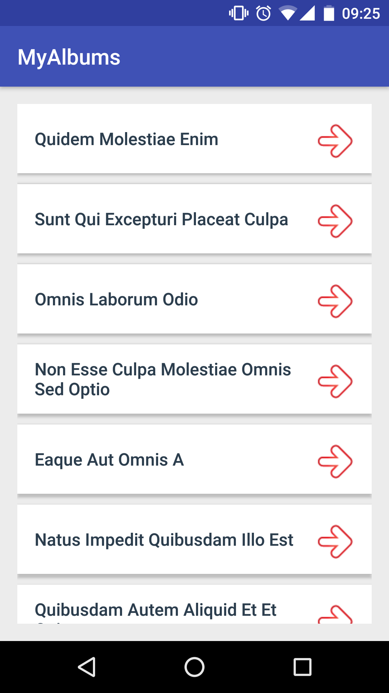
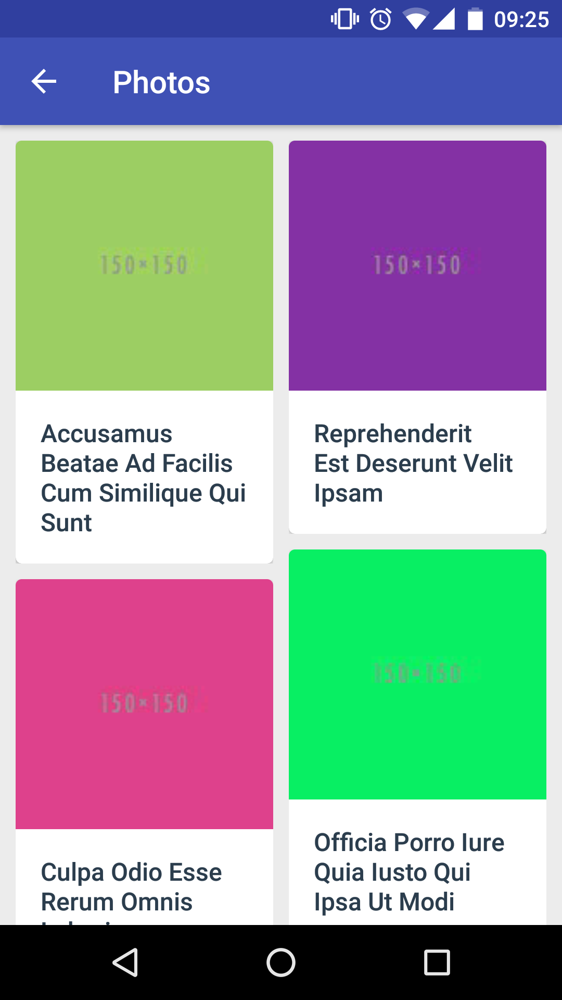

# **Ovidos Challenge Android Application**

This project is created for intern appeal. It uses prepared API service. It pulls list of title of Photo Album and show them in the ListView. Then, it shows photos and photo's titles of clicked album in RecyclerView.

Data comes from [JSONPlaceholder](http://jsonplaceholder.typicode.com/)

## Screenshots
 

## Installation & Usage
```bash
# Clone the repository
$ git clone https://github.com/omralcrt/ovidos-challenge.git

# Import project to Android Studio
```

## License
	Copyright 2017 Ömral Cörüt
	
	Licensed under the Apache License, Version 2.0 (the "License");
	you may not use this file except in compliance with the License.
	You may obtain a copy of the License at
	
	  http://www.apache.org/licenses/LICENSE-2.0
	
	Unless required by applicable law or agreed to in writing, software
	distributed under the License is distributed on an "AS IS" BASIS,
	WITHOUT WARRANTIES OR CONDITIONS OF ANY KIND, either express or implied.
	See the License for the specific language governing permissions and
	limitations under the License.